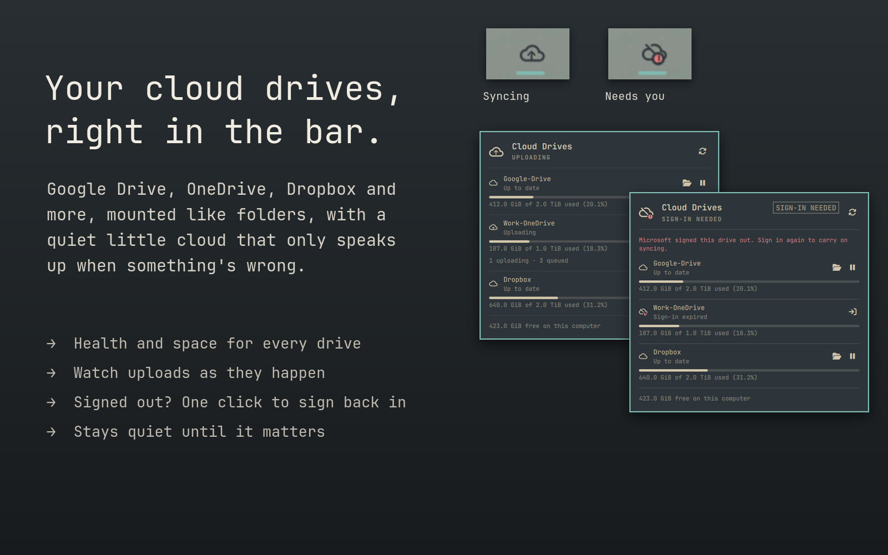
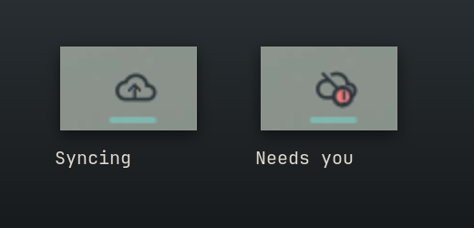
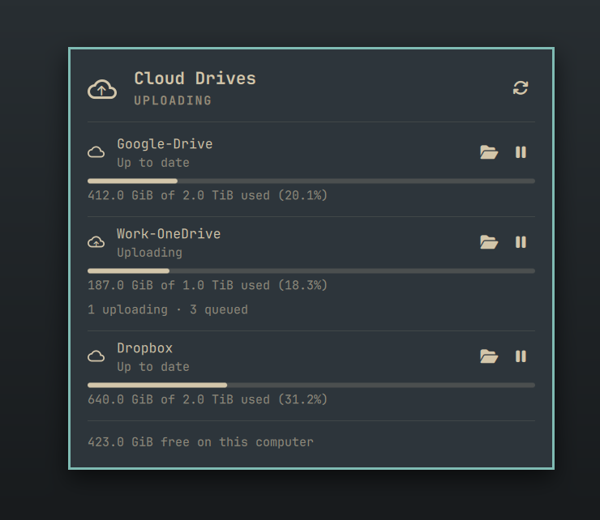
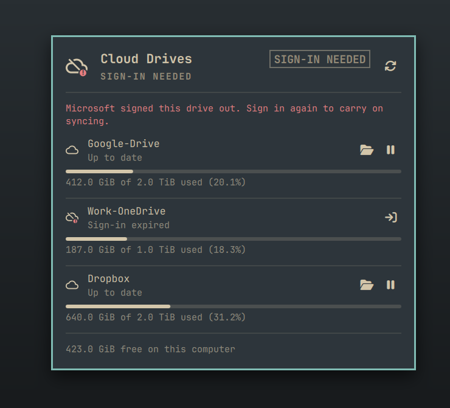
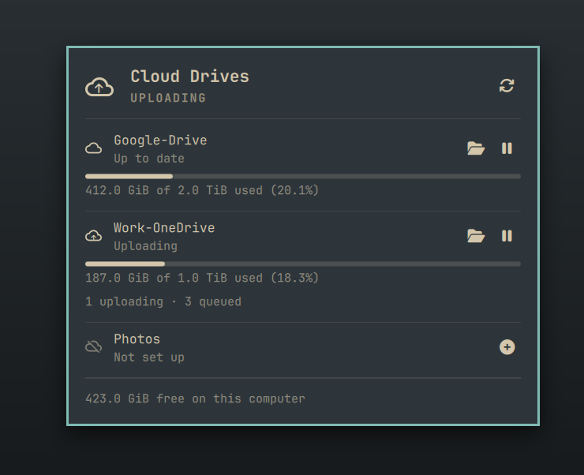

# Cloud Drives — an Omarchy bar widget for rclone mounts

Your cloud drives, right in the bar. Google Drive, OneDrive, Dropbox, or
anything else rclone can mount, shown the way the OneDrive and Google Drive
desktop apps do it.



## What you get

rclone is brilliant at mounting cloud storage as ordinary folders. It's much
less good at telling you when something's quietly gone wrong: a drive that
signed itself out, uploads that stalled, a disk filling up with cache.
Cloud Drives keeps an eye on all of that and tells you in plain words.

**A quiet cloud in the bar.** It sits there looking like everything else on
your bar. A little arrow appears inside it while something's uploading, and it
only changes shape or gets a badge when a drive actually needs you.



**Every drive at a glance.** Click it for each drive's state, and how much of
your storage it's using, with the recycle bin counted properly. You also see
the free space on *this* computer, which is the number that runs out first
when rclone keeps a local cache.



**It tells you what's wrong, and fixes it in one click.** Each problem comes
with the one thing that will actually help. Signed out? **Sign in** opens the
sign-in for you, having safely paused that drive first. Stuck? **Restart**.
Missing its folder? It makes it.



**Adding a drive is one click too.** Set up a new remote in rclone, and it
shows up here, ready to mount.



**Nothing scary.** It only ever touches the `rclone-mount@` units it ships, and
never your rclone config or its sign-in tokens. It needs no sudo, and has
nothing system-wide.

**Works with** any remote rclone can mount. It's built and used daily with
Google Drive and OneDrive.

## What it shows

**In the bar** — a monochrome *outline* cloud, stroked to sit at the same weight
as its neighbours. A small arrow appears inside it while an upload is in flight;
the mark becomes `cloud-off-outline` when a drive is not carrying data (stopped,
or signed out); and an urgent `!` badge appears only for a genuine fault. Colour
is never used for an ordinary "on" state, so a healthy machine has a quiet bar.

The first version used Font Awesome's *solid* cloud and was visibly the boldest
thing on the bar — every neighbour (bluetooth, the globe, Wi-Fi, the WireGuard
ouroboros) is a stroked outline, so a filled mass of foreground pixels read as
heavier and brighter than everything beside it. Material's `cloud-outline`
(U+F0163) carries the same silhouette at the right weight, and `cloud-off-outline`
(U+F0164) gives a designed strike instead of a Rectangle drawn across the glyph.
Note this font ships an older MDI subset with no outline upload/download variant
(`F1B0x` is absent entirely), which is why activity is an arrow composited into
the cloud's hollow interior rather than a different glyph.

**In the panel** — per drive: state, storage meter with the recycle bin
accounted for, and contextual actions (the mount path appears in each action's
tooltip rather than as a row of its own). Below that, free space on
*this computer*, which is a different number from account storage and the one
that bites first with `--vfs-cache-mode full`.

## The states, and why there are this many

A FUSE cloud mount fails in ways a single "is the unit running" check reports
as perfectly healthy. Each of these is a distinct row, because each has a
different remedy:

| State | What it means | Remedy offered |
|---|---|---|
| Remote missing | the unit's remote is no longer in `rclone.conf`, usually renamed | move or disable the unit (below) |
| Up to date | mounted, responsive, writable | — |
| Sign-in expired | the OAuth refresh token is dead | Sign in again |
| Clock is wrong | `invalid_grant`, but NTP is not synced | wait (self-heals) |
| Cannot start | systemd refused it — usually the mount directory is missing | Create folder and start |
| Not responding | mounted and "active", but IO hangs | Restart |
| Read-only | mounted, but every save fails silently | Restart |
| Storage full | ≥98% of quota, from a *fresh* reading | — |
| Mount failing | restart loop for some other reason | Restart |
| Throttled by provider | rate-limited; rclone retries on its own | wait (self-heals) |
| Starting / Reconnecting | cold start, or transient network | wait |
| Stopped | you stopped it | Start |
| Not set up | a remote in `rclone.conf` with no mount unit yet | Set up |

Three of those exist because the obvious signal lies:

- **Not responding.** A SIGSTOPped rclone still reports `ActiveState=active` and
  still appears in `/proc/mounts`. Only IO reveals it, so the helper spends a
  `statfs` with a hard timeout per mounted drive.
- **Cannot start** vs **Stopped.** systemd records a failed
  `AssertPathIsDirectory` in `AssertResult`, leaving `Result=success` and the
  unit `inactive/dead` — byte-identical to a drive you switched off. Telling
  someone they turned a drive off when it is actually broken is the one
  attribution a status widget must never get wrong, so `AssertResult` is read
  and `blocked` outranks `stopped`.
- **Clock is wrong.** A system clock a few minutes out makes OAuth refresh fail
  with exactly `invalid_grant` — the same string as a genuinely dead token. One
  needs you to sign in; the other fixes itself. `timedatectl` separates them.

## Sign-in expiry gets special handling

It is the failure this widget was written for, and it has two traps.

**The remedy must not flap.** An expired token puts the unit in a ~10s restart
loop, and for about a second after each restart the journal has not yet been
written. A poll landing in that window sees no `invalid_grant` and reclassifies
the drive from "sign-in expired" to "mount failing" — which would offer a
*Restart* button on a drive that restarting can never fix, and re-fire a
critical desktop notification roughly every twelve seconds, forever. So auth is
latched once seen and cleared only by evidence of health, and no state may raise
a notification until it has held for two consecutive polls.

**Reconnecting must stop the unit first.** `rclone config reconnect` rewrites
`~/.config/rclone/rclone.conf` while the restart loop is re-reading it every ten
seconds — a read-during-rewrite race on the only credential store on the
machine. The Sign in button runs `stop`, then reconnect, then `reset-failed`,
then `start`, in a visible terminal so the browser OAuth has somewhere to
report to.

## Install

The widget shows mounts; it doesn't create them. Each drive is an instance of
a `rclone-mount@` systemd user unit whose instance name is both the rclone
remote and the mount directory under `$HOME`: `rclone-mount@GDrive` mounts
`GDrive:` on `~/GDrive`. The widget finds drives by that unit name. A template
that works this way ships in `systemd/`.

```bash
omarchy plugin add https://github.com/jonspinks/omarchy-rclone --enable

# The mount template, plus the optional rc drop-in (see "Live transfer
# activity"). -n never overwrites a unit you already have.
cp -rn ~/.config/omarchy/plugins/blacksheep.rclone/systemd/. ~/.config/systemd/user/
systemctl --user daemon-reload
```

Then, for each remote you've set up with `rclone config`:

```bash
mkdir -m 700 ~/GDrive                       # same name as the remote, case included
systemctl --user enable --now rclone-mount@GDrive
```

If you already have your own `rclone-mount@.service`, keep it. Any template
works, as long as it's called `rclone-mount@` and follows the naming rule.

## Remove

```bash
omarchy plugin remove blacksheep.rclone
```

That takes the widget off the bar and deletes the plugin folder. Your mounts
keep running: the units, the remotes and `~/.config/rclone/rclone.conf` are
yours, and the widget never changes them on its own. To remove the mounts too,
`systemctl --user disable --now rclone-mount@<Name>` each one, then delete
`~/.config/systemd/user/rclone-mount@.service` and
`~/.config/systemd/user/rclone-mount@.service.d/` if you installed them from
here. The only other thing it leaves is a few small state files in
`~/.cache/omarchy/rclone-status/`, which are safe to delete.

## Requirements

`rclone`, `fuse3` (the template unmounts with `fusermount3`), `python3`, and a
systemd user session, which Omarchy has. Notifications go through
`omarchy notification send`, and **Sign in** opens a terminal with
`omarchy-launch-floating-terminal-with-presentation`, so it needs Omarchy.
No sudo, and nothing outside your own user units and rclone config.

## Adding a drive

**A drive is a `rclone-mount@<Name>` unit, not a remote.** The helper also
reads `rclone listremotes` to check the two lists against each other. A remote
you have just made in `rclone config` shows up as **Not set up**, dimmed, with a
**Set up** button. The button creates `~/<Name>` (mode 700) and runs
`systemctl --user enable --now rclone-mount@<Name>`. A not-set-up remote is not
a fault: it does not change the bar icon or the badge, and it
never sends a notification. By hand, that is:

```bash
rclone config                       # name the remote e.g. OneDrive-Work
mkdir -m 700 ~/OneDrive-Work        # same name, case included
systemctl --user enable --now rclone-mount@OneDrive-Work
```

Hyphens in the name are fine: the template uses the escaped `%i`, and the
widget keeps the instance name escaped too, so the remote, the directory and
the unit all agree. A name that systemd *would* escape, such as one with a
space, reads "Not set up — rename to mount" and gets no button: the template
cannot mount it under that name.

**Renaming a remote strands its mount.** When you rename a remote in
`rclone config`, for example `OneDrive` to `OneDrive-Personal` to make room
for a second account, the running `rclone-mount@OneDrive` carries on working
from the config it loaded at startup. Nothing else would say anything until
the next restart or reboot, when it fails, because `OneDrive:` no longer exists.
The widget catches it first: the old row turns **Remote missing** and sends one
normal-urgency notification, and the new name appears as **Not set up**.
Remote missing outranks every other state. It offers no Restart or Sign in,
because neither can work without the remote. Move the
mount with the rename, when nothing is uploading:

```bash
systemctl --user disable --now rclone-mount@OneDrive
rmdir ~/OneDrive && mkdir -m 700 ~/OneDrive-Personal
systemctl --user enable --now rclone-mount@OneDrive-Personal
```

Check that the panel shows no queued uploads for the drive first. Pending
uploads are cached under `~/.cache/rclone/vfs/<remote>`. Under the new name
they would be stranded, not sent.

Removing a drive works the same way: `disable --now` its unit before you
delete the remote.

## The helper

`scripts/rclone-status` prints one JSON object. Run it by hand to see
everything the widget sees:

```bash
~/.config/omarchy/plugins/blacksheep.rclone/scripts/rclone-status | jq
```

The widget runs this copy directly, so `omarchy plugin update` updates the
helper along with the panel. (Earlier versions ran a copy under
`~/.config/omarchy/bar/scripts/`. That copy is no longer used and can be
deleted.)

It holds all the policy, which is why the classifier is testable without a
running shell — a `--poll` argument is what permits it to write latch state, so
running it by hand never consumes a transition the widget was about to notify on.

## Live transfer activity (optional)

Upload counts, VFS cache usage and the current speed limit come from rclone's
rc API, which is off by default.

**There is no per-upload throughput figure, and that is deliberate.** For a
mount, `core/stats` reports only a session-wide average and its `transferring[]`
array stays empty — verified against a real upload, where the "speed" on offer
read 7.9 MiB/s while the mount was throttled to 1 MiB/s. A number that wrong
next to its own limit is worse than no number, so the panel shows counts
("1 uploading", "3 queued") and leaves throughput out.
`systemd/rclone-mount@.service.d/rc.conf` is a drop-in that turns it on, one
unix socket per instance, and the install above copies it. To go without it,
delete `~/.config/systemd/user/rclone-mount@.service.d/rc.conf`. See the
comments in that file — in particular, do not turn it into a TCP port without
adding authentication. Until it is installed the panel says so rather than
letting an absent capability read as a healthy drive with nothing going on.

## Deliberately not built

- **Per-file sync ticks.** rclone exposes no per-file state for a mounted VFS;
  a green tick per file would be decoration, not information.
- **Pause sync.** There is no honest rclone analogue. `core/bwlimit` throttles
  but does not pause, and it silently resets on every mount restart. A pause
  button that quietly does nothing is worse than no pause button.
- **Selective folder sync.** A mount is not a sync; there is nothing to select.
